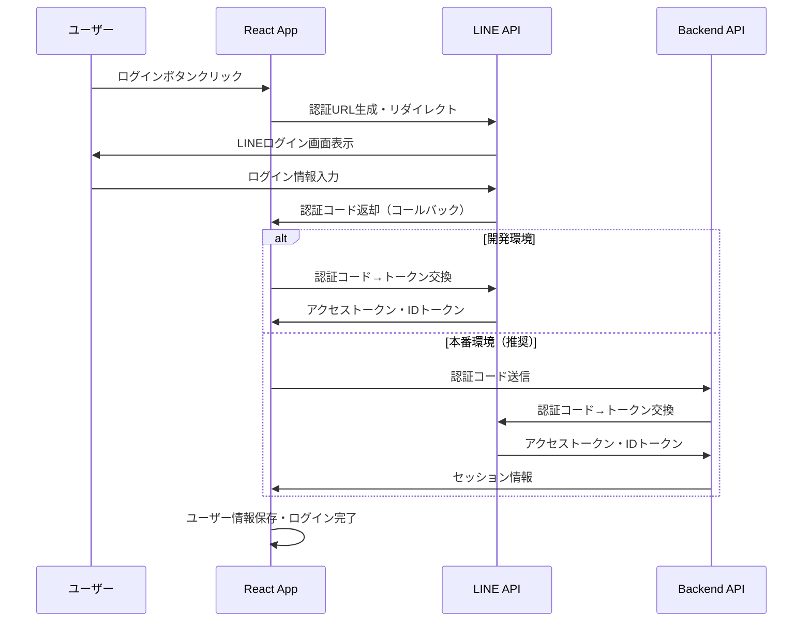

# LINEログインAPI 実装ガイド

## 📋 概要

このガイドでは、LINEログインAPIを使用してReact Webアプリケーションに認証機能を実装する手順を説明します。

## 🔧 必要な準備

### 1. LINE Developers Console での設定

#### 1.1 LINEログインチャネルの作成
1. [LINE Developers Console](https://developers.line.biz/console/) にアクセス
2. プロバイダーを選択または新規作成
3. 「新しいチャネルを作成」→「LINEログイン」を選択
4. 必要情報を入力してチャネルを作成

#### 1.2 チャネル設定
- **チャネル基本設定** タブで以下を確認：
  - Channel ID（アプリで使用）
  - Channel Secret（バックエンドで使用）

#### 1.3 LINEログイン設定
- **LINEログイン** タブで以下を設定：
  - コールバックURL：
    - 開発環境：`http://localhost:5173/auth/callback`
    - 本番環境：`https://yourdomain.com/auth/callback`
  - アプリタイプ：ウェブアプリ
  - OpenID Connect：有効化（推奨）

### 2. 環境変数の設定

プロジェクトルートに `.env` ファイルを作成：

```env
# LINE Login Configuration
VITE_LINE_CHANNEL_ID=your_channel_id_here
VITE_LINE_CHANNEL_SECRET=your_channel_secret_here  # 開発環境のみ
VITE_LINE_REDIRECT_URI=http://localhost:5173/auth/callback
```

⚠️ **セキュリティ注意事項**：
- `VITE_LINE_CHANNEL_SECRET` は開発環境でのみ使用
- 本番環境では Channel Secret をクライアントサイドで使用しない

## 🚀 実装状況

現在のプロジェクトでは以下が実装済みです：

### ✅ 完成済み
- LINEログインUI (`src/components/LineLogin.tsx`)
- 認証コンテキスト (`src/contexts/AuthContext.tsx`)
- 認証コールバック (`src/components/AuthCallback.tsx`)
- 認証ユーティリティ (`src/utils/auth.ts`)
- 型定義 (`src/types/auth.ts`)
- セッション管理機能

### 🔄 追加実装可能な機能
- バックエンドAPI連携（セキュリティ向上）
- リフレッシュトークン対応
- LINE Messaging API連携

## 📖 実装の流れ

### 1. 認証フロー



### 2. ファイル構成

```
src/
├── components/
│   ├── LineLogin.tsx       # ログインUI
│   └── AuthCallback.tsx    # 認証コールバック処理
├── contexts/
│   └── AuthContext.tsx     # 認証状態管理
├── utils/
│   └── auth.ts            # 認証ユーティリティ
└── types/
    └── auth.ts            # 型定義
```

## 🔐 セキュリティ対策

### 実装済みセキュリティ機能

1. **State パラメータ検証**
   - CSRF攻撃防止
   - ランダムなstateパラメータ生成・検証

2. **IDトークン検証**
   - Issuer検証
   - Audience検証
   - 有効期限チェック

3. **セッション管理**
   - 24時間の自動期限切れ
   - 定期的なセッション検証

### 追加推奨セキュリティ対策

1. **本番環境での対応**
   ```javascript
   // Channel Secretをクライアントサイドで使用しない
   // バックエンドAPIでトークン交換を行う
   ```

2. **HTTPS必須**
   ```
   本番環境では必ずHTTPSを使用
   ```

3. **CSP（Content Security Policy）設定**
   ```html
   <meta http-equiv="Content-Security-Policy" 
         content="default-src 'self'; connect-src 'self' https://api.line.me;">
   ```

## 🧪 テスト手順

### 1. 環境変数設定確認
```bash
# .envファイルの設定を確認
echo $VITE_LINE_CHANNEL_ID
```

### 2. 開発サーバー起動
```bash
npm run dev
```

### 3. ログインテスト
1. `http://localhost:5173` にアクセス
2. 「LINEでログイン」ボタンをクリック
3. LINE認証画面でログイン
4. アプリに戻ってログイン状態を確認

## 🚨 トラブルシューティング

### よくある問題と解決方法

#### 1. 「Channel IDが設定されていません」エラー
**原因**: 環境変数が正しく設定されていない
**解決**: `.env`ファイルの設定を確認

#### 2. 「redirect_uri_mismatch」エラー
**原因**: LINE Developers Consoleの設定とアプリの設定が一致しない
**解決**: コールバックURLを確認・修正

#### 3. トークン交換エラー
**原因**: Channel Secretが無効または未設定
**解決**: LINE Developers Consoleで設定を確認

#### 4. セッション期限切れ
**原因**: 24時間以上経過
**解決**: 再ログインが必要（正常な動作）

### デバッグ方法

```javascript
// ブラウザのConsoleで認証状態を確認
console.log('Auth User:', localStorage.getItem('line_auth_user'));
console.log('Auth Timestamp:', localStorage.getItem('line_auth_timestamp'));
```

## 📚 参考資料

- [LINE Login API Documentation](https://developers.line.biz/ja/docs/line-login/)
- [OpenID Connect Specification](https://openid.net/connect/)
- [OAuth 2.0 Security Best Practices](https://tools.ietf.org/html/draft-ietf-oauth-security-topics)

## 🔄 本番環境への移行

本番環境では以下の対応が必要です：

1. **バックエンドAPI実装**
   - `backend-example.js` を参考に実装
   - Redis等でセッション管理

2. **環境変数の分離**
   ```env
   # 本番環境
   VITE_LINE_CHANNEL_ID=production_channel_id
   VITE_LINE_REDIRECT_URI=https://yourdomain.com/auth/callback
   # Channel Secretは環境変数で管理（クライアントには含めない）
   ```

3. **HTTPS対応**
   - SSL証明書の設定
   - リダイレクトURI更新

4. **監視・ログ設定**
   - 認証エラーの監視
   - セキュリティログの設定 